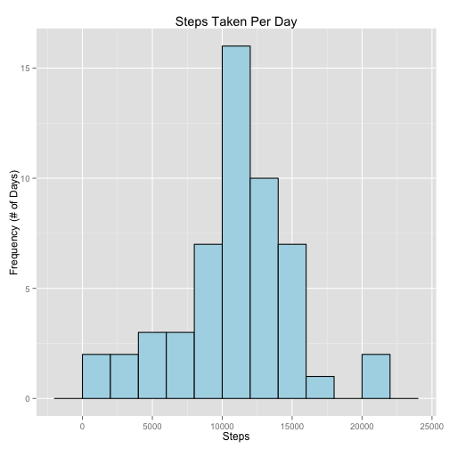
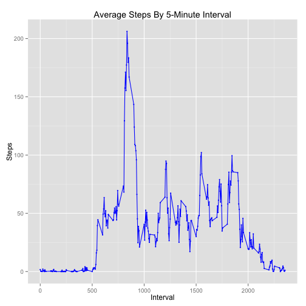
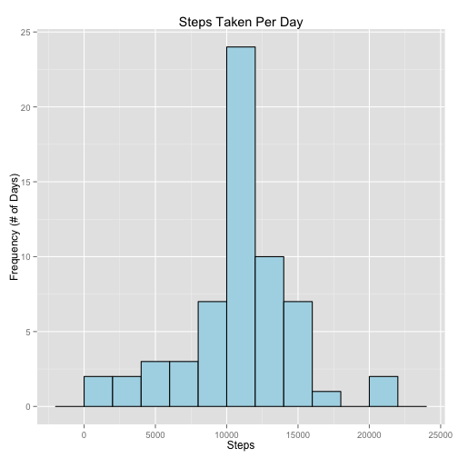
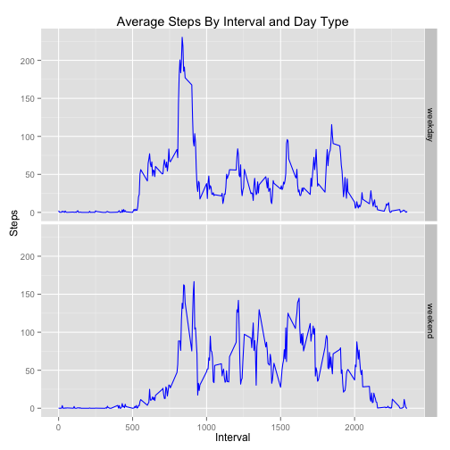

In this project, we will examine the Activity Monitoring dataset. This dataset contains data on the number of steps taken by a person during 5-minute intervals each day for two months.

Prerequisites:

- the ggplot2 and reshape2 packages must be installed
- the file "activity.csv" must be in your working directory

First, the basics: let's load the required libraries as well as the data from our activity.csv file.


```r
library(ggplot2)
library(reshape2)

originalData <- read.csv("activity.csv")
```

We'll need the original data frame later, so all of our work will be done on a copy, named data. Let's get rid of all the lines of our data frame that have missing data.


```r
data <- originalData[!is.na(originalData$steps),]
```

Next, we'll use tapply to sum the total steps over all the intervals for each date in the dataset. Since tapply returns a list, we'll then change it back into a data frame, and take a peek at the result.


```r
stepsPerDay <- tapply(data$steps,data$date,sum)
stepsPerDay <- data.frame(Date=names(stepsPerDay),Steps=stepsPerDay,row.names=NULL)
stepsPerDay <- stepsPerDay[!is.na(stepsPerDay$Steps),]

head(stepsPerDay)
```

```
##         Date Steps
## 2 2012-10-02   126
## 3 2012-10-03 11352
## 4 2012-10-04 12116
## 5 2012-10-05 13294
## 6 2012-10-06 15420
## 7 2012-10-07 11015
```

Now we are ready to make a plot of the data. We will make a histogram of the total steps taken per day. Let's also find the mean and median number of steps per day.


```r
ggplot(data=stepsPerDay,aes(x=Steps)) + geom_histogram(binwidth=2000,color="black",fill="lightblue") + ggtitle("Steps Taken Per Day") + ylab("Frequency (# of Days)")
```

 

```r
mean(stepsPerDay$Steps)
```

```
## [1] 10766.19
```

```r
median(stepsPerDay$Steps)
```

```
## [1] 10765
```

Next, instead of looking at total steps per day, let's look at mean number of steps *per interval*. For each of the 288 5-minute intervals (12 per hour, times 24 hours in a day), let's find the average number of steps taken over the two-month sample. Again, tapply and data.frame are useful. We must be careful here to make sure the intervals in our resulting data frame are numerics, not characters.

Let's also make sure we were able to calculate an actual value for every interval. The sum command here should return 0.


```r
stepsPerInterval <- tapply(data$steps,data$interval,mean)
stepsPerIntervalDF <- data.frame(Interval=as.numeric(names(stepsPerInterval)),Steps=stepsPerInterval,row.names=NULL)

sum(is.na(stepsPerIntervalDF$Steps))
```

```
## [1] 0
```

Now let's plot the result. The x axis here is essentially the time of day (since the intervals are named by the corresponding 24-hour time) and the y axis is steps taken during that interval.


```r
ggplot(data=stepsPerIntervalDF, aes(x=Interval,y=Steps,group=1)) + geom_point(color="blue",size=1) + geom_line(color="blue") + ggtitle("Average Steps By 5-Minute Interval")
```

 

If we want to know during what time interval the highest number of steps are taken, and how many steps, this is easy to find using the max function.


```r
stepsPerIntervalDF[stepsPerIntervalDF$Steps==max(stepsPerIntervalDF$Steps),]
```

```
##     Interval    Steps
## 104      835 206.1698
```

Because we have ignored missing values thus far, our examination of the data could be slightly off. Instead, let's fill in any missing values with the mean number of steps taken in the interval containing the missing value. Using sum again, and our originalData object, we will make sure that only the steps column contains missing values (not the date or interval columns), and also check how many missing values there are in the steps column.

Then we will create a vector containing the row numbers of every missing steps value from the dataset, and for each such value, fill it in with the mean number of steps for that value's time interval. Notice we are referencing the stepsPerInterval list returned earlier by tapply, not the data frame.


```r
sum(is.na(originalData$date)+is.na(originalData$interval))
```

```
## [1] 0
```

```r
sum(is.na(originalData$steps))
```

```
## [1] 2304
```

```r
missingRows <- which(is.na(originalData$steps))

for (i in missingRows)
{
  originalData[i,"steps"] <- stepsPerInterval[[as.character(originalData[i,"interval"])]]
}

data <- originalData
```

Now we will reproduce the same exploratory analysis from earlier, but on our new dataset with the imputed values.


```r
stepsPerDay <- tapply(data$steps,data$date,sum)
stepsPerDay <- data.frame(Date=names(stepsPerDay),Steps=stepsPerDay,row.names=NULL)
stepsPerDay <- stepsPerDay[!is.na(stepsPerDay$Steps),]

ggplot(data=stepsPerDay,aes(x=Steps)) + geom_histogram(binwidth=2000,color="black",fill="lightblue") + ggtitle("Steps Taken Per Day") + ylab("Frequency (# of Days)")
```

 

```r
mean(stepsPerDay$Steps)
```

```
## [1] 10766.19
```

```r
median(stepsPerDay$Steps)
```

```
## [1] 10766.19
```

Notice how the median matches the mean now, and how the graph is more tightly centered. This is to be expected since we used average values to fill in the missing values.

Finally, we wish to explore potential differences between step patterns on weekdays versus weekends. We create a function that takes a date string as input, and outputs "weekday" or "weekend". We then use sapply to run this function along every date in the dataset, allowing us to add a "DayType" factor column.


```r
daytype <- function(date)
{
  dayname <- weekdays(strptime(date,format="%Y-%m-%d"))
	if (identical(dayname,"Saturday") || identical(dayname,"Sunday")) { return("weekend") }
	else { return("weekday") }
}

originalData$dayType <- sapply(as.character(originalData$date),daytype)

originalData$dayType <- as.factor(originalData$dayType)
```

Now we want to do the same calculation as earlier, finding the mean number of steps taken by interval, but we also want it separated by day type. The by function can be used for this purpose, followed by rbind and some data.frame calls.


```r
stepsPerIntervalByDayType <- as.data.frame(rbind(by(originalData$steps,originalData[,c("interval","dayType")],mean)))

stepsPerIntervalByDayType <- data.frame(Interval=as.numeric(row.names(stepsPerIntervalByDayType)),weekday= stepsPerIntervalByDayType$weekday,weekend=stepsPerIntervalByDayType$weekend)
```

We can now make two plots, similar to the previous plot but separated by day type. To do this with ggplot2, we first need to use melt to change the data frame from wide format to long format.


```r
stepsPerIntervalByDayType <- melt(stepsPerIntervalByDayType,id.vars="Interval")
names(stepsPerIntervalByDayType) <- c("Interval","DayType","Steps")

ggplot(data=stepsPerIntervalByDayType,aes(x=Interval,y=Steps)) + facet_grid(DayType ~ .) + geom_line(color="blue") + ggtitle("Average Steps By Interval and Day Type")
```

 
